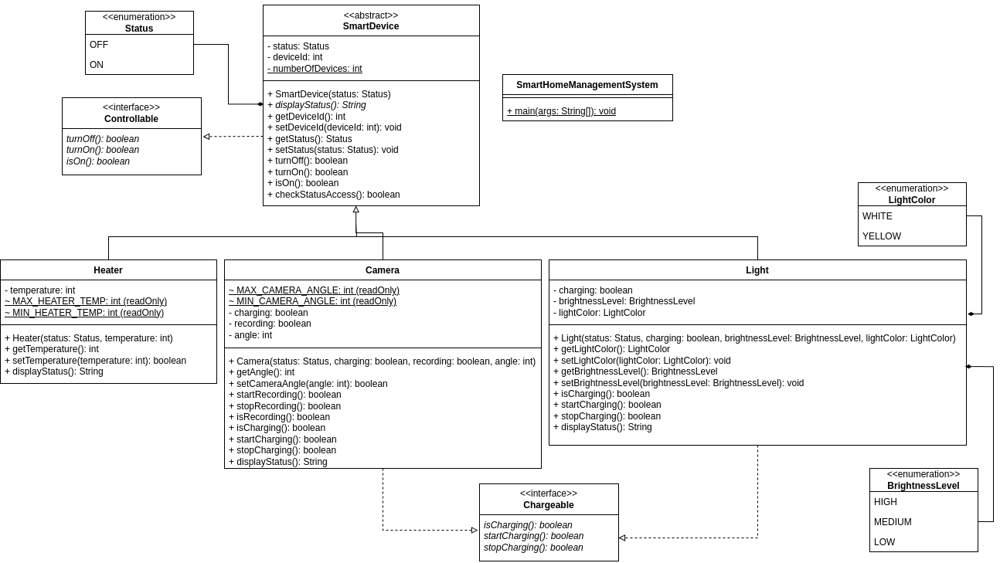
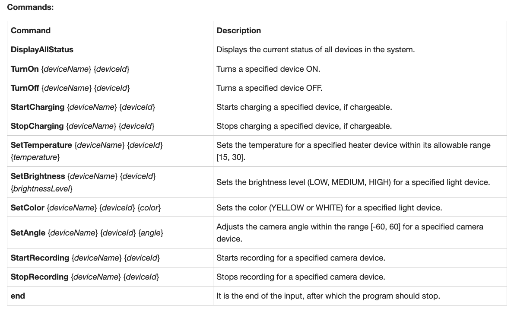
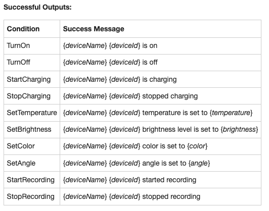

# Assignment 3: Smart Home System

A command processor for Lights, Cameras, and Heaters. Each device supports state changes and a restricted set of configurable attributes. Commands print a success message or a specific error based on the current state and rules.

## Device model

- Lights (IDs 0-3): ON by default, YELLOW, LOW brightness
- Cameras (IDs 4-5): ON by default, angle 45, not recording
- Heaters (IDs 6-9): ON by default, temperature 20

## Input / Output

- Reads commands from standard input.
- Stops on `end`.

## Assets

## Solution

- Java source: `SmartHomeManagementSystem.java`
